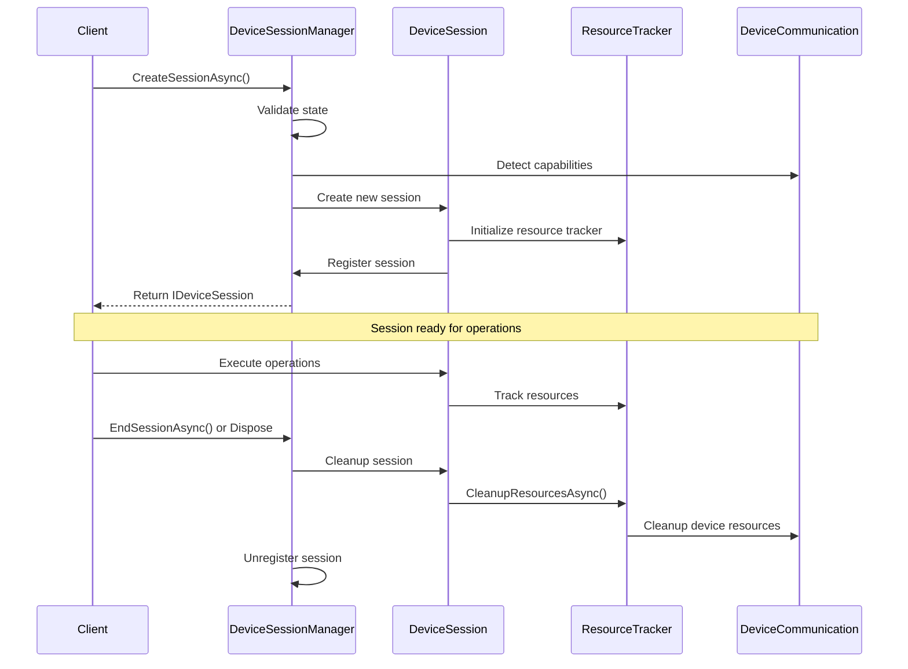

# Session Management Architecture

The Session Management system is a foundational component of Belay.NET that provides centralized coordination of device operations, resource tracking, and lifecycle management. This system ensures that operations are properly isolated, resources are tracked and cleaned up, and device state remains consistent across concurrent operations.

## Architectural Overview

### The Challenge

Device programming with MicroPython presents several architectural challenges:

- **Concurrent Operations**: Multiple operations may run simultaneously on the same device
- **Resource Tracking**: Background threads, deployed methods, and device resources need lifecycle management
- **State Isolation**: Operations should not interfere with each other's device state
- **Cleanup Management**: Proper cleanup is critical on resource-constrained devices
- **Session Coordination**: Complex operations may span multiple device communications

### The Solution

The Session Management system provides:

1. **Centralized Session Coordination**: DeviceSessionManager handles all session lifecycle operations
2. **Resource Tracking**: Comprehensive tracking of all session-associated resources
3. **Isolation**: Session boundaries ensure operations don't interfere with each other
4. **Automatic Cleanup**: Guaranteed cleanup of session resources
5. **Cross-Component Integration**: Unified session context across executors, file system, and device communication

## Core Components

### DeviceSessionManager

The `DeviceSessionManager` is the central coordinator for all device sessions:

```csharp
public interface IDeviceSessionManager : IAsyncDisposable
{
    string? CurrentSessionId { get; }
    DeviceSessionState State { get; }
    IDeviceCapabilities? Capabilities { get; }
    
    Task<IDeviceSession> CreateSessionAsync(IDeviceCommunication communication, 
        CancellationToken cancellationToken = default);
    Task<IDeviceSession> GetOrCreateSessionAsync(IDeviceCommunication communication,
        CancellationToken cancellationToken = default);
    Task EndSessionAsync(string sessionId, CancellationToken cancellationToken = default);
    
    Task<T> ExecuteInSessionAsync<T>(IDeviceCommunication communication,
        Func<IDeviceSession, Task<T>> operation, CancellationToken cancellationToken = default);
    Task ExecuteInSessionAsync(IDeviceCommunication communication,
        Func<IDeviceSession, Task> operation, CancellationToken cancellationToken = default);
    
    Task<SessionStats> GetSessionStatsAsync(CancellationToken cancellationToken = default);
}
```

**Key Responsibilities:**
- Session lifecycle management (create, manage, terminate)
- Device capability detection and caching
- Cross-session resource coordination
- Performance monitoring and statistics
- Integration with dependency injection container

### DeviceSession

Individual sessions provide isolated contexts for device operations:

```csharp
public interface IDeviceSession : IAsyncDisposable
{
    string SessionId { get; }
    DateTime CreatedAt { get; }
    bool IsActive { get; }
    
    ISessionState State { get; }
    IResourceTracker Resources { get; }
    IExecutorContext ExecutorContext { get; }
    IDeviceContext DeviceContext { get; }
    IFileSystemContext FileSystemContext { get; }
}
```

**Session Components:**
- **SessionState**: Operation-specific data storage
- **ResourceTracker**: Tracks and manages session resources
- **ExecutorContext**: Session-aware executor coordination
- **DeviceContext**: Device-specific session information
- **FileSystemContext**: Session-aware file operations

### Resource Tracking

The `IResourceTracker` provides comprehensive resource management:

```csharp
public interface IResourceTracker : IAsyncDisposable
{
    // Background Thread Management
    Task RegisterBackgroundThreadAsync(string threadId, string methodName, CancellationToken cancellationToken = default);
    Task UnregisterBackgroundThreadAsync(string threadId, CancellationToken cancellationToken = default);
    IReadOnlyList<BackgroundThreadInfo> GetActiveThreads();
    
    // Method Deployment Tracking
    Task RegisterDeployedMethodAsync(string signature, byte[] codeHash, CancellationToken cancellationToken = default);
    bool IsMethodDeployed(string signature, byte[] codeHash);
    IReadOnlyList<DeployedMethodInfo> GetDeployedMethods();
    
    // General Resource Management
    Task RegisterResourceAsync(ISessionResource resource, CancellationToken cancellationToken = default);
    Task<IReadOnlyList<ISessionResource>> GetActiveResourcesAsync(CancellationToken cancellationToken = default);
    ResourceUsageStats GetResourceStats();
    Task CleanupResourcesAsync(CancellationToken cancellationToken = default);
}
```

## Session Lifecycle

### Session Creation Flow



### Session State Machine

Sessions follow a clear state machine:

```csharp
public enum DeviceSessionState
{
    Inactive,    // Session manager is inactive
    Active,      // Session manager is active and ready
    Shutdown,    // Session manager is shutting down
    Disposed     // Session manager has been disposed
}
```

**State Transitions:**
- `Inactive` → `Active`: First session creation
- `Active` → `Active`: Normal operation
- `Active` → `Shutdown`: Explicit shutdown initiated
- `Shutdown` → `Disposed`: Cleanup completed
- Any state → `Disposed`: Emergency disposal

## Resource Management

### Background Thread Tracking

Background threads created with `[Thread]` attribute are automatically tracked:

```csharp
public sealed record BackgroundThreadInfo
{
    public required string ThreadId { get; init; }
    public required string MethodName { get; init; }
    public required DateTime RegisteredAt { get; init; }
    public required string SessionId { get; init; }
}
```

**Thread Lifecycle:**
1. Thread creation registers with `RegisterBackgroundThreadAsync()`
2. Thread execution monitored by session
3. Session cleanup stops threads with `UnregisterBackgroundThreadAsync()`
4. Automatic cleanup on session disposal

### Method Deployment Caching

Deployed methods are tracked for performance optimization:

```csharp
public sealed record DeployedMethodInfo
{
    public required string Signature { get; init; }
    public required byte[] CodeHash { get; init; }
    public required DateTime DeployedAt { get; init; }
    public required string SessionId { get; init; }
}
```

**Deployment Workflow:**
1. Method execution checks `IsMethodDeployed()`
2. If not deployed, code is sent to device
3. Successful deployment registers with `RegisterDeployedMethodAsync()`
4. Future calls use cached deployment
5. Session cleanup invalidates cached methods

### Generic Resource Tracking

The session resource system supports custom resource types:

```csharp
public interface ISessionResource : IAsyncDisposable
{
    string ResourceId { get; }
    string ResourceType { get; }
    int EstimatedCost { get; }
    DateTime CreatedAt { get; }
    Task CleanupAsync(CancellationToken cancellationToken = default);
}
```

**Custom Resource Example:**
```csharp
public class DeviceTimerResource : ISessionResource
{
    public string ResourceId { get; }
    public string ResourceType => "DeviceTimer";
    public int EstimatedCost => 50; // Memory cost estimate
    public DateTime CreatedAt { get; }
    
    public async Task CleanupAsync(CancellationToken cancellationToken = default)
    {
        // Stop timer on device
        await deviceCommunication.ExecuteAsync("timer.deinit()", cancellationToken);
    }
    
    public async ValueTask DisposeAsync()
    {
        await CleanupAsync();
    }
}
```

## Integration Architecture

### Executor Framework Integration

Sessions provide context for all executor operations:

```csharp
public interface IExecutorContext
{
    string SessionId { get; }
    IResourceTracker ResourceTracker { get; }
    
    Task<bool> IsMethodDeployedAsync(string signature, byte[] codeHash);
    Task RegisterMethodDeploymentAsync(string signature, byte[] codeHash);
    Task<string> AllocateThreadIdAsync(string methodName);
}
```

**Executor Integration Points:**
- **TaskExecutor**: Uses session for method deployment caching
- **ThreadExecutor**: Registers background threads with session
- **SetupExecutor**: Session initialization and capability detection
- **TeardownExecutor**: Session cleanup coordination

### File System Integration

File operations are session-aware through `IFileSystemContext`:

```csharp
public interface IFileSystemContext
{
    string SessionId { get; }
    
    Task<FileSystemState> GetStateAsync();
    Task InvalidateCacheAsync(string path);
    Task RegisterFileOperationAsync(FileOperation operation);
}
```

**File System Benefits:**
- Session-scoped file system state caching
- Operation tracking for debugging
- Automatic cache invalidation on session end
- Coordinated cleanup of temporary files

### Device Communication Integration

Sessions coordinate with device communication layers:

```csharp
public interface IDeviceContext
{
    string SessionId { get; }
    IDeviceCapabilities? Capabilities { get; }
    
    Task<ProtocolCapabilities> GetProtocolCapabilitiesAsync();
    Task<DeviceInfo> GetDeviceInfoAsync();
    Task RegisterProtocolMetricsAsync(ProtocolMetrics metrics);
}
```

## Dependency Injection Integration

### Service Registration

Session management integrates with .NET's dependency injection:

```csharp
// In Belay.Extensions
public static class ServiceCollectionExtensions
{
    public static IServiceCollection AddBelaySessionManagement(
        this IServiceCollection services,
        Action<SessionManagementOptions>? configure = null)
    {
        services.Configure<SessionManagementOptions>(configure ?? (_ => {}));
        
        services.AddSingleton<IDeviceSessionManager, DeviceSessionManager>();
        services.AddTransient<IDeviceSession, DeviceSession>();
        services.AddTransient<IResourceTracker, ResourceTracker>();
        
        return services;
    }
}
```

### Configuration Options

```csharp
public class SessionManagementOptions
{
    public TimeSpan DefaultSessionTimeout { get; set; } = TimeSpan.FromMinutes(30);
    public int MaxConcurrentSessions { get; set; } = 10;
    public bool EnableSessionMetrics { get; set; } = true;
    public bool EnableResourceTracking { get; set; } = true;
    public TimeSpan ResourceCleanupTimeout { get; set; } = TimeSpan.FromSeconds(30);
}
```

### Usage with DI

```csharp
public class IoTDeviceService
{
    private readonly IDeviceSessionManager sessionManager;
    
    public IoTDeviceService(IDeviceSessionManager sessionManager)
    {
        this.sessionManager = sessionManager;
    }
    
    public async Task<DeviceStatus> GetDeviceStatusAsync(IDeviceCommunication communication)
    {
        return await sessionManager.ExecuteInSessionAsync(communication, async session =>
        {
            // Operation automatically gets session context
            var status = await communication.ExecuteAsync<DeviceStatus>("get_status()");
            
            // Resource tracking happens automatically
            session.Resources.RegisterResourceAsync(new StatusQueryResource());
            
            return status;
        });
    }
}
```

## Performance Considerations

### Session Overhead

The session management system is designed for minimal overhead:

**Session Creation Time:**
- Cold session creation: ~10-50ms (includes capability detection)
- Warm session creation: ~1-5ms (cached capabilities)
- Session reuse: <1ms overhead

**Memory Overhead:**
- Base session: ~2KB per active session
- Resource tracking: ~100 bytes per tracked resource
- Method cache: ~500 bytes per cached method

### Optimization Strategies

**Session Reuse:**
```csharp
// Efficient: Reuse session for multiple operations
await sessionManager.ExecuteInSessionAsync(communication, async session =>
{
    var result1 = await communication.ExecuteAsync("operation1()");
    var result2 = await communication.ExecuteAsync("operation2()");
    return new { result1, result2 };
});

// Inefficient: Create new session for each operation
var result1 = await sessionManager.ExecuteInSessionAsync(communication, async session =>
    await communication.ExecuteAsync("operation1()"));
var result2 = await sessionManager.ExecuteInSessionAsync(communication, async session =>
    await communication.ExecuteAsync("operation2()"));
```

**Resource Tracking Optimization:**
```csharp
// Configure tracking granularity
var options = new SessionManagementOptions
{
    EnableResourceTracking = true,  // Full tracking in development
    EnableSessionMetrics = false,   // Disable metrics in production
};
```

## Error Handling and Recovery

### Session Error Scenarios

**Capability Detection Failure:**
```csharp
try
{
    var session = await sessionManager.CreateSessionAsync(communication);
}
catch (DeviceCapabilityException ex)
{
    // Fallback to basic session with minimal capabilities
    var fallbackSession = await sessionManager.CreateSessionAsync(communication, 
        SessionCreationOptions.WithFallbackCapabilities());
}
```

**Resource Cleanup Failure:**
```csharp
public class RobustResourceTracker : IResourceTracker
{
    public async Task CleanupResourcesAsync(CancellationToken cancellationToken = default)
    {
        var exceptions = new List<Exception>();
        
        foreach (var resource in activeResources)
        {
            try
            {
                await resource.CleanupAsync(cancellationToken);
            }
            catch (Exception ex)
            {
                exceptions.Add(ex);
                logger.LogWarning("Failed to cleanup resource {ResourceId}: {Error}", 
                    resource.ResourceId, ex.Message);
            }
        }
        
        if (exceptions.Count > 0)
        {
            throw new ResourceCleanupException("Some resources failed to cleanup", exceptions);
        }
    }
}
```

### Recovery Strategies

**Session Recovery:**
```csharp
public async Task<T> ExecuteWithRetryAsync<T>(
    IDeviceCommunication communication,
    Func<IDeviceSession, Task<T>> operation,
    int maxRetries = 3)
{
    for (int attempt = 1; attempt <= maxRetries; attempt++)
    {
        try
        {
            return await sessionManager.ExecuteInSessionAsync(communication, operation);
        }
        catch (SessionException ex) when (ex.IsRecoverable && attempt < maxRetries)
        {
            logger.LogWarning("Session operation failed (attempt {Attempt}), retrying: {Error}", 
                attempt, ex.Message);
            
            await Task.Delay(TimeSpan.FromSeconds(Math.Pow(2, attempt))); // Exponential backoff
        }
    }
    
    throw new SessionException($"Operation failed after {maxRetries} attempts");
}
```

## Monitoring and Diagnostics

### Session Metrics

```csharp
public record SessionStats
{
    public int ActiveSessionCount { get; init; }
    public int TotalSessionCount { get; init; }
    public int MaxSessionCount { get; init; }
}

public record ResourceUsageStats
{
    public int TotalResources { get; init; }
    public int TotalResourceCost { get; init; }
    public IReadOnlyDictionary<string, int> ResourcesByType { get; init; }
    public int BackgroundThreads { get; init; }
    public int DeployedMethods { get; init; }
}
```

### Diagnostic Logging

```csharp
logger.LogInformation("Session {SessionId} created for device {DeviceId}", 
    session.SessionId, deviceId);
logger.LogDebug("Resource registered: {ResourceType} {ResourceId} (cost: {Cost})",
    resource.ResourceType, resource.ResourceId, resource.EstimatedCost);
logger.LogDebug("Background thread {ThreadId} registered for method {Method}",
    threadId, methodName);
logger.LogInformation("Session {SessionId} ended, cleaned up {ResourceCount} resources",
    sessionId, resourceCount);
```

### Performance Monitoring

```csharp
public class SessionPerformanceMonitor
{
    private readonly IMetrics metrics;
    
    public void RecordSessionCreation(TimeSpan duration)
    {
        metrics.Counter("belay.sessions.created").Increment();
        metrics.Histogram("belay.sessions.creation_duration").Record(duration.TotalMilliseconds);
    }
    
    public void RecordResourceRegistration(string resourceType)
    {
        metrics.Counter("belay.sessions.resources.registered")
            .WithTag("resource_type", resourceType)
            .Increment();
    }
}
```

## Testing Strategies

### Unit Testing Sessions

```csharp
[TestClass]
public class DeviceSessionManagerTests
{
    [TestMethod]
    public async Task CreateSessionAsync_WithValidCommunication_ShouldReturnActiveSession()
    {
        // Arrange
        var mockCommunication = new Mock<IDeviceCommunication>();
        var sessionManager = new DeviceSessionManager(loggerFactory);
        
        // Act
        var session = await sessionManager.CreateSessionAsync(mockCommunication.Object);
        
        // Assert
        Assert.IsNotNull(session);
        Assert.IsTrue(session.IsActive);
        Assert.IsNotNull(session.SessionId);
    }
    
    [TestMethod]
    public async Task ExecuteInSessionAsync_ShouldProvideSessionContext()
    {
        // Arrange
        var mockCommunication = new Mock<IDeviceCommunication>();
        var sessionManager = new DeviceSessionManager(loggerFactory);
        string capturedSessionId = null;
        
        // Act
        await sessionManager.ExecuteInSessionAsync(mockCommunication.Object, async session =>
        {
            capturedSessionId = session.SessionId;
            await Task.CompletedTask;
        });
        
        // Assert
        Assert.IsNotNull(capturedSessionId);
    }
}
```

### Integration Testing

```csharp
[TestClass]
public class SessionIntegrationTests
{
    [TestMethod]
    public async Task SessionWithResourceTracking_ShouldTrackAndCleanupResources()
    {
        // Arrange
        using var device = CreateTestDevice();
        var sessionManager = new DeviceSessionManager(loggerFactory);
        
        // Act
        await sessionManager.ExecuteInSessionAsync(device.Communication, async session =>
        {
            // Register test resources
            await session.Resources.RegisterResourceAsync(new TestResource("test1"));
            await session.Resources.RegisterResourceAsync(new TestResource("test2"));
            
            var stats = session.Resources.GetResourceStats();
            Assert.AreEqual(2, stats.TotalResources);
        });
        
        // Assert - resources should be cleaned up automatically
        var finalStats = await sessionManager.GetSessionStatsAsync();
        Assert.AreEqual(0, finalStats.ActiveSessionCount);
    }
}
```

## Best Practices

### Session Scope Management

**Do:** Use `ExecuteInSessionAsync` for operation grouping:
```csharp
await sessionManager.ExecuteInSessionAsync(communication, async session =>
{
    // All operations share the same session context
    await InitializeDevice(communication);
    var data = await CollectData(communication);
    await ProcessData(communication, data);
});
```

**Don't:** Create sessions manually without proper disposal:
```csharp
// Risky - manual session management
var session = await sessionManager.CreateSessionAsync(communication);
// ... operations ...
// Easy to forget cleanup!
```

### Resource Management

**Do:** Register custom resources for automatic cleanup:
```csharp
public async Task StartMonitoringAsync(IDeviceSession session)
{
    var timerResource = new DeviceTimerResource(timerId);
    await session.Resources.RegisterResourceAsync(timerResource);
    // Timer will be cleaned up automatically when session ends
}
```

**Don't:** Ignore resource registration:
```csharp
// Bad - timer won't be cleaned up
await communication.ExecuteAsync("timer = Timer(1000, callback)");
```

### Error Handling

**Do:** Handle session-specific errors appropriately:
```csharp
try
{
    await sessionManager.ExecuteInSessionAsync(communication, operation);
}
catch (SessionException ex) when (ex.IsRecoverable)
{
    // Implement retry logic
    await RetryWithNewSession(communication, operation);
}
catch (ResourceCleanupException ex)
{
    // Log cleanup failures but don't fail the operation
    logger.LogWarning("Some resources failed to cleanup: {Error}", ex.Message);
}
```

## Related Documentation

- [Executor Framework Internals](/technical/architecture/executor-framework) - How executors integrate with sessions
- [Raw REPL Protocol Deep Dive](/technical/protocols/raw-repl-protocol) - Protocol capability detection
- [Configuration Guide](/guide/configuration#session-management) - Session configuration options
- [Dependency Injection Guide](/guide/dependency-injection) - DI container integration

## Migration Guide

### From Manual Resource Management

**Before (Manual):**
```csharp
var device = new Device(communication);
try
{
    await device.ExecuteAsync("setup_hardware()");
    var result = await device.ExecuteAsync("collect_data()");
    return result;
}
finally
{
    await device.ExecuteAsync("cleanup_hardware()");
}
```

**After (Session-Managed):**
```csharp
await sessionManager.ExecuteInSessionAsync(communication, async session =>
{
    await communication.ExecuteAsync("setup_hardware()");
    
    // Register cleanup resource
    await session.Resources.RegisterResourceAsync(new HardwareCleanupResource());
    
    return await communication.ExecuteAsync("collect_data()");
    // Cleanup happens automatically
});
```

The Session Management system provides the architectural foundation for robust, scalable device programming with proper resource lifecycle management and cross-component coordination.