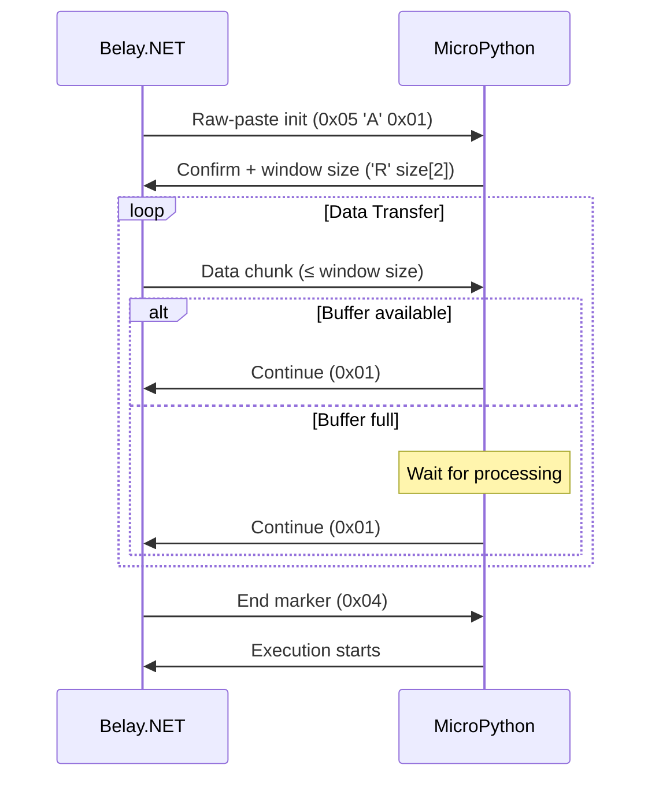

# Raw-Paste Mode and Flow Control

Raw-paste mode is an advanced extension of the MicroPython Raw REPL protocol that provides efficient flow control for large code transfers. This protocol enhancement was introduced to address buffer limitations on resource-constrained microcontrollers while maintaining transfer reliability.

## Overview

### The Buffer Problem

Traditional Raw REPL mode sends code as a continuous stream, which can overwhelm device buffers:

- **ESP32**: Typical 128-512 byte buffers
- **STM32**: 1-2KB buffers  
- **RP2040**: 256-512 byte buffers

When code exceeds buffer capacity, devices may:
- Drop characters silently
- Hang waiting for buffer space
- Reset due to memory exhaustion

### Raw-Paste Mode Solution

Raw-paste mode implements a **sliding window protocol** similar to TCP, providing:

1. **Flow Control**: Device controls transfer rate
2. **Buffer Management**: Prevents overflow conditions
3. **Error Recovery**: Detects and handles transmission errors
4. **Efficiency**: Optimal throughput within device constraints

## Protocol Specification

### Initialization Sequence

**Step 1: Enter Raw Mode**
```
→ 0x01                              # Ctrl-A (enter raw mode)
← "raw REPL; CTRL-B to exit\r\n>"  # Raw mode confirmation
```

**Step 2: Negotiate Raw-Paste Mode**
```
→ 0x05 'A' 0x01                     # Raw-paste initialization
← 'R' 0x01 [windowsize LSB MSB]     # Confirmation + window size
```

**Step 3: Verify Support**
- If device responds with 'R', raw-paste mode is supported
- Window size is provided as 16-bit little-endian value
- If no response or different character, fall back to standard raw mode

### Data Transfer Protocol

**Window Management:**



### Flow Control Bytes

| Byte | Meaning | Action Required |
|------|---------|-----------------|
| `0x01` | Window increment | Send more data (up to window size) |
| `0x04` | End of data expected | Complete transfer with 0x04 |
| Other | Protocol error | Abort and retry |

## Implementation Details

### Belay.NET Flow Control Algorithm

```csharp
private async Task SendCodeWithFlowControlAsync(string code, int initialWindowSize)
{
    byte[] codeBytes = Encoding.UTF8.GetBytes(code);
    int remainingWindowSize = initialWindowSize;
    int offset = 0;
    
    logger.LogDebug("Starting flow-controlled transfer: {CodeLength} bytes, initial window: {WindowSize}", 
        codeBytes.Length, initialWindowSize);

    while (offset < codeBytes.Length)
    {
        // Wait for buffer space if window is exhausted
        if (remainingWindowSize == 0)
        {
            var windowIncrement = await WaitForFlowControlSignalAsync();
            remainingWindowSize = windowIncrement;
            logger.LogTrace("Received window increment: {WindowSize}", windowIncrement);
        }

        // Send data up to available window size
        int chunkSize = Math.Min(remainingWindowSize, codeBytes.Length - offset);
        await stream.WriteAsync(codeBytes.AsMemory(offset, chunkSize));
        await stream.FlushAsync();
        
        offset += chunkSize;
        remainingWindowSize -= chunkSize;
        
        logger.LogTrace("Sent chunk: {ChunkSize} bytes, remaining: {Remaining}", 
            chunkSize, codeBytes.Length - offset);
    }

    // Signal end of data
    await stream.WriteAsync(new byte[] { 0x04 });
    logger.LogDebug("Transfer completed: {TotalBytes} bytes", codeBytes.Length);
}
```

### Window Size Optimization

**Adaptive Window Management:**

```csharp
public class FlowControlOptimizer
{
    private int baseWindowSize;
    private readonly Dictionary<string, int> deviceOptimalSizes = new();
    
    public int GetOptimalWindowSize(DeviceReplCapabilities capabilities)
    {
        // Use device-specific optimization if available
        if (deviceOptimalSizes.TryGetValue(capabilities.DetectedPlatform, out int optimized))
        {
            return Math.Min(optimized, capabilities.MaxWindowSize);
        }
        
        // Conservative default based on platform
        return capabilities.DetectedPlatform switch
        {
            "esp32" => Math.Min(64, capabilities.MaxWindowSize),
            "stm32" => Math.Min(256, capabilities.MaxWindowSize),
            "rp2" => Math.Min(128, capabilities.MaxWindowSize),
            _ => Math.Min(32, capabilities.MaxWindowSize) // Very conservative default
        };
    }
    
    public void RecordPerformance(string platform, int windowSize, TimeSpan transferTime, int dataSize)
    {
        // Calculate throughput and adjust optimal window size
        double throughputBps = dataSize / transferTime.TotalSeconds;
        
        if (throughputBps > GetBenchmarkThroughput(platform))
        {
            // Good performance, can try larger windows
            deviceOptimalSizes[platform] = Math.Min(windowSize * 2, 1024);
        }
        else
        {
            // Poor performance, reduce window size
            deviceOptimalSizes[platform] = Math.Max(windowSize / 2, 16);
        }
    }
}
```

## Performance Characteristics

### Throughput Analysis

**Factors Affecting Transfer Speed:**

1. **Window Size**: Larger windows reduce round-trip overhead
2. **Device Processing Speed**: Affects flow control signal frequency
3. **USB/Serial Latency**: Round-trip time between control messages
4. **Code Complexity**: Parser overhead during reception

**Optimal Window Sizes by Platform:**

| Platform | Optimal Size | Max Throughput | Notes |
|----------|--------------|----------------|--------|
| ESP32-S3 | 64-128 bytes | ~2KB/sec | USB CDC native |
| ESP32 (Classic) | 32-64 bytes | ~1KB/sec | UART bridge |
| Pyboard v1.1 | 256-512 bytes | ~8KB/sec | Fast USB CDC |
| Pico (RP2040) | 128-256 bytes | ~4KB/sec | Good USB impl |
| CircuitPython | Varies | ~500B/sec | Conservative |

### Latency Considerations

**Round-Trip Components:**

1. **USB Packet Time**: ~1ms per USB frame
2. **Device Processing**: Variable (10-100ms)
3. **Buffer Allocation**: Memory management overhead
4. **Parser Processing**: Code parsing during reception

**Optimization Strategies:**

```csharp
// Minimize round trips with optimal chunking
private int CalculateOptimalChunkSize(DeviceReplCapabilities caps, int codeLength)
{
    // Balance window size with total round trips
    int maxChunks = Math.Max(1, codeLength / caps.PreferredWindowSize);
    int optimalChunkSize = codeLength / Math.Min(maxChunks, 10); // Max 10 chunks
    
    return Math.Min(optimalChunkSize, caps.MaxWindowSize);
}
```

## Error Handling and Recovery

### Common Failure Modes

#### 1. Window Starvation

**Symptoms:**
- Transfer hangs waiting for flow control signal
- Partial code deployment

**Detection:**
```csharp
private async Task<int> WaitForFlowControlSignalAsync()
{
    using var timeoutCts = CancellationTokenSource.CreateLinkedTokenSource(cancellationToken);
    timeoutCts.CancelAfter(flowControlTimeout);
    
    try
    {
        byte[] buffer = new byte[1];
        await stream.ReadExactlyAsync(buffer, timeoutCts.Token);
        
        return buffer[0] switch
        {
            0x01 => detectedCapabilities.PreferredWindowSize,
            0x04 => throw new FlowControlException("Unexpected end-of-data signal"),
            _ => throw new FlowControlException($"Invalid flow control byte: 0x{buffer[0]:X2}")
        };
    }
    catch (OperationCanceledException)
    {
        throw new FlowControlException("Flow control timeout - device may be unresponsive");
    }
}
```

**Recovery Strategy:**
1. Cancel current transfer
2. Send soft reset (Ctrl-C)
3. Re-enter raw mode
4. Retry with smaller window size

#### 2. Buffer Corruption

**Detection:**
- Execution errors from malformed code
- Syntax errors in correctly formed code
- Unexpected character sequences

**Prevention:**
```csharp
private async Task ValidateTransferIntegrityAsync(string originalCode)
{
    // Send validation command to check code integrity
    string validationCode = $"len({repr(originalCode)})";
    var result = await ExecuteSimpleCommandAsync(validationCode);
    
    if (int.Parse(result) != Encoding.UTF8.GetByteCount(originalCode))
    {
        throw new FlowControlException("Code transfer integrity check failed");
    }
}
```

### Recovery Mechanisms

**Progressive Fallback Strategy:**

```csharp
public async Task<string> ExecuteWithReliableTransferAsync(string code)
{
    var strategies = new[]
    {
        () => ExecuteWithRawPasteModeAsync(code, capabilities.PreferredWindowSize),
        () => ExecuteWithRawPasteModeAsync(code, capabilities.PreferredWindowSize / 2),
        () => ExecuteWithRawPasteModeAsync(code, 32), // Conservative window
        () => ExecuteWithChunkedRawModeAsync(code), // Fallback to raw mode
    };
    
    Exception lastException = null;
    
    foreach (var strategy in strategies)
    {
        try
        {
            return await strategy();
        }
        catch (FlowControlException ex)
        {
            lastException = ex;
            logger.LogWarning("Transfer strategy failed, trying next: {Error}", ex.Message);
            
            // Reset device state before retry
            await SoftResetDeviceAsync();
        }
    }
    
    throw new AggregateException("All transfer strategies failed", lastException);
}
```

## Advanced Features

### Compression Support

For large code deployments, consider pre-compression:

```csharp
private async Task<string> ExecuteWithCompressionAsync(string code)
{
    if (code.Length > compressionThreshold && capabilities.SupportsZlib)
    {
        string compressedCode = $@"
import zlib
exec(zlib.decompress({Convert.ToBase64String(Compress(code))}))";
        
        return await ExecuteWithRawPasteModeAsync(compressedCode);
    }
    
    return await ExecuteWithRawPasteModeAsync(code);
}
```

### Progress Reporting

```csharp
public event EventHandler<TransferProgressEventArgs> TransferProgress;

private async Task SendCodeWithProgressAsync(string code, int windowSize)
{
    byte[] codeBytes = Encoding.UTF8.GetBytes(code);
    int totalBytes = codeBytes.Length;
    int sentBytes = 0;
    
    // ... transfer logic ...
    
    // Report progress after each chunk
    var progressArgs = new TransferProgressEventArgs
    {
        BytesSent = sentBytes,
        TotalBytes = totalBytes,
        PercentComplete = (double)sentBytes / totalBytes * 100,
        EstimatedTimeRemaining = CalculateTimeRemaining(sentBytes, totalBytes, startTime)
    };
    
    TransferProgress?.Invoke(this, progressArgs);
}
```

## Device-Specific Implementations

### ESP32 Quirks

```csharp
// ESP32 requires special handling for USB CDC
private async Task HandleESP32FlowControlAsync()
{
    // ESP32-S2/S3 CDC has different buffer behavior
    if (capabilities.DetectedPlatform?.Contains("esp32s") == true)
    {
        // Use smaller windows to prevent CDC buffer issues
        capabilities.PreferredWindowSize = Math.Min(capabilities.PreferredWindowSize, 64);
        
        // Add small delays to prevent overwhelming USB stack
        await Task.Delay(5, cancellationToken);
    }
}
```

### Pyboard Optimizations

```csharp
// Pyboard has excellent USB implementation, can use larger windows
private void OptimizeForPyboard(DeviceReplCapabilities caps)
{
    if (caps.DetectedPlatform?.Contains("pyboard") == true)
    {
        caps.PreferredWindowSize = Math.Min(caps.MaxWindowSize, 512);
        caps.SupportsLargeCodeTransfers = true;
    }
}
```

## Benchmarking and Testing

### Performance Test Suite

```csharp
[TestMethod]
public async Task TestFlowControlPerformance()
{
    var testCodes = new[]
    {
        GenerateCode(1024),   // 1KB
        GenerateCode(4096),   // 4KB  
        GenerateCode(16384),  // 16KB
    };
    
    foreach (var code in testCodes)
    {
        var stopwatch = Stopwatch.StartNew();
        await ExecuteWithRawPasteModeAsync(code);
        stopwatch.Stop();
        
        double throughputKbps = (code.Length / 1024.0) / stopwatch.Elapsed.TotalSeconds;
        Assert.IsTrue(throughputKbps > expectedMinThroughput[capabilities.DetectedPlatform]);
    }
}
```

### Flow Control Validation

```csharp
[TestMethod]
public async Task ValidateFlowControlProtocol()
{
    // Test that flow control signals arrive at expected intervals
    var signals = new List<(DateTime timestamp, byte signal)>();
    
    // Monitor flow control during transfer
    await ExecuteWithRawPasteModeAsync(largeCode, onFlowControlSignal: (signal) =>
    {
        signals.Add((DateTime.UtcNow, signal));
    });
    
    // Verify signal timing and sequence
    Assert.IsTrue(signals.All(s => s.signal == 0x01)); // All should be continue signals
    Assert.IsTrue(signals.Count > 1); // Should have multiple signals for large transfers
}
```

## Configuration Reference

### Optimal Settings by Use Case

**Development/Debugging:**
```json
{
  "Protocol": {
    "RawRepl": {
      "EnableRawPasteAutoDetection": true,
      "PreferredWindowSize": null,
      "EnableVerboseLogging": true,
      "MaxRetryAttempts": 5,
      "RetryDelayMs": 200
    }
  }
}
```

**Production Deployment:**
```json
{
  "Protocol": {
    "RawRepl": {
      "EnableRawPasteAutoDetection": true,
      "PreferredWindowSize": 128,
      "EnableVerboseLogging": false,
      "MaxRetryAttempts": 3,
      "RetryDelayMs": 100
    }
  }
}
```

**High-Throughput Applications:**
```json
{
  "Protocol": {
    "RawRepl": {
      "EnableAdaptiveFlowControl": true,
      "MinimumWindowSize": 64,
      "MaximumWindowSize": 1024,
      "BaseResponseTimeoutMs": 1000
    }
  }
}
```

## Related Documentation

- [Raw REPL Protocol Deep Dive](/technical/protocols/raw-repl-protocol)
- [Adaptive Protocol Detection](/technical/protocols/protocol-detection)
- [Configuration Guide](/guide/configuration#adaptive-repl-protocol-configuration)
- [Performance Troubleshooting](/hardware/troubleshooting-performance)