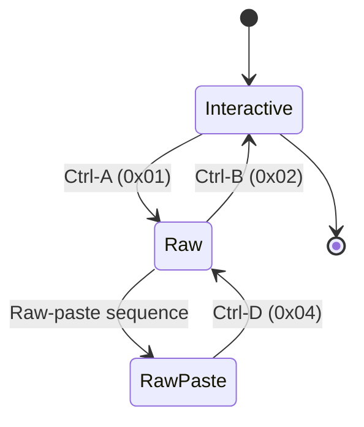

# Raw REPL Protocol Deep Dive

The Raw REPL (Read-Eval-Print Loop) protocol is the foundation of all communication between Belay.NET and MicroPython devices. This protocol enables programmatic execution of Python code on microcontrollers with reliable error handling and output capture.

## Introduction

### What is the Raw REPL Protocol?

The Raw REPL protocol is a specialized communication mode in MicroPython that allows external programs to send Python code for execution and receive structured responses. Unlike the interactive REPL (the `>>>` prompt familiar to Python developers), Raw REPL is designed for automation and programmatic control.

**Key Differences from Interactive REPL:**

| Feature | Interactive REPL | Raw REPL |
|---------|------------------|----------|
| **Purpose** | Human interaction | Programmatic control |
| **Input Format** | Line-by-line with prompts | Code blocks with delimiters |
| **Output Structure** | Mixed with prompts | Structured responses |
| **Error Handling** | Visual formatting | Parseable error codes |
| **Flow Control** | Human pacing | Automated flow control |

### Why Belay.NET Uses Raw REPL

Belay.NET exclusively uses Raw REPL for several critical reasons:

1. **Reliability**: Structured responses eliminate parsing ambiguity
2. **Performance**: No prompt handling overhead
3. **Error Detection**: Clear separation of successful output and errors
4. **Large Code Support**: Raw-paste mode enables efficient large code deployment
5. **Automation-Friendly**: No human interaction required

## Protocol Fundamentals

### Protocol State Machine

The Raw REPL protocol operates as a state machine with distinct phases:



### Entering Raw Mode

**Command Sequence:**
```
Send: 0x01 (Ctrl-A)
Receive: "raw REPL; CTRL-B to exit\r\n>"
```

**Belay.NET Implementation:**
```csharp
private async Task EnterRawModeAsync(CancellationToken cancellationToken)
{
    // Send Ctrl-A to enter raw mode
    await stream.WriteAsync(new byte[] { 0x01 }, cancellationToken);
    await stream.FlushAsync(cancellationToken);

    // Wait for confirmation response
    string response = await ReadWithTimeoutAsync(adaptiveResponseTimeout, cancellationToken);
    
    if (!response.Contains("raw REPL"))
    {
        throw new RawReplProtocolException("Failed to enter raw REPL mode");
    }
}
```

### Raw Mode Communication Flow

Once in Raw Mode, the protocol follows this pattern:

1. **Code Transmission**: Send Python code as UTF-8 bytes
2. **Execution Trigger**: Send 0x04 (Ctrl-D) to execute
3. **Confirmation**: Receive "OK" + 0x04 + 0x02
4. **Output Reception**: Receive stdout/stderr until next 0x04
5. **Error Check**: Parse output for execution results

**Example Session:**
```
→ 0x01                              # Enter raw mode
← "raw REPL; CTRL-B to exit\r\n>"  # Confirmation
→ "print('Hello, World!')"          # Send Python code  
→ 0x04                              # Execute command
← "OK" 0x04 0x02                    # Execution started
← "Hello, World!\r\n"              # Program output
← 0x04                              # Output complete
→ 0x02                              # Exit raw mode (optional)
← ">>>"                             # Return to interactive mode
```

## Raw-Paste Mode Extensions

Raw-paste mode is an advanced extension of the Raw REPL protocol that provides flow control for large code transfers.

### Protocol Negotiation

**Detection Sequence:**
```
Send: 0x05 'A' 0x01  # Raw-paste initialization
Receive: 'R' 0x01    # Confirmation + window size (16-bit little-endian)
```

**Belay.NET Detection Code:**
```csharp
private async Task<bool> DetectRawPasteModeAsync(CancellationToken cancellationToken)
{
    await stream.WriteAsync(RAWPASTE_INIT, cancellationToken); // [0x05, 'A', 0x01]
    
    string response = await ReadLineAsync(cancellationToken);
    if (!response.StartsWith('R'))
    {
        return false; // Raw-paste mode not supported
    }
    
    // Read window size increment (16-bit little-endian)
    byte[] windowSizeBytes = new byte[2];
    await stream.ReadExactlyAsync(windowSizeBytes, cancellationToken);
    detectedWindowSize = BitConverter.ToUInt16(windowSizeBytes, 0);
    
    return true;
}
```

### Window-Based Flow Control

Raw-paste mode implements a sliding window protocol to prevent buffer overflows on resource-constrained devices.

**Flow Control Mechanism:**

1. **Initial Window**: Device advertises available buffer space
2. **Data Transfer**: Send data up to window limit
3. **Window Update**: Device sends 0x01 when ready for more data
4. **End Signal**: Send 0x04 when transfer complete

**Window Management Algorithm:**
```csharp
private async Task SendCodeWithFlowControlAsync(string code, int windowSize)
{
    byte[] codeBytes = Encoding.UTF8.GetBytes(code);
    int remainingWindowSize = windowSize;
    int offset = 0;

    while (offset < codeBytes.Length)
    {
        if (remainingWindowSize == 0)
        {
            // Wait for flow control signal
            remainingWindowSize = await WaitForFlowControlAsync();
        }

        int chunkSize = Math.Min(remainingWindowSize, codeBytes.Length - offset);
        await stream.WriteAsync(codeBytes.AsMemory(offset, chunkSize));
        
        offset += chunkSize;
        remainingWindowSize -= chunkSize;
    }
}
```

## Implementation in Belay.NET

### Adaptive Protocol System

Belay.NET implements an adaptive protocol system that automatically detects device capabilities and optimizes communication parameters:

**Capability Detection Process:**

1. **Basic REPL Test**: Verify raw mode functionality
2. **Timing Measurement**: Measure device response characteristics  
3. **Raw-Paste Detection**: Test advanced flow control support
4. **Flow Control Validation**: Verify reliable window management
5. **Parameter Optimization**: Adjust timeouts and buffer sizes

### Device Fingerprinting

```csharp
public class DeviceReplCapabilities
{
    public bool SupportsRawPasteMode { get; set; }
    public int PreferredWindowSize { get; set; }
    public TimeSpan AverageResponseTime { get; set; }
    public bool RequiresExtendedStartup { get; set; }
    public string? DetectedPlatform { get; set; }
    public bool HasReliableFlowControl { get; set; }
}
```

### Code Deployment Strategy

Belay.NET uses a multi-tiered approach for code deployment:

**Small Code Blocks (< 512 bytes):**
- Use standard Raw REPL mode
- Single transmission with execution trigger
- Optimal for method calls and simple operations

**Medium Code Blocks (512B - 4KB):**
- Use Raw-paste mode if available
- Single window transfer
- Fallback to chunked Raw REPL if needed

**Large Code Blocks (> 4KB):**
- Always use Raw-paste mode with flow control
- Multi-window transfers with progress tracking
- Comprehensive error recovery

## Device-Specific Considerations

### ESP32/ESP8266 Variations

**Characteristics:**
- USB-to-serial bridge introduces latency
- Limited buffer sizes (typically 128-512 bytes)
- Boot sequence can take 2-3 seconds
- May require extended interrupt delays

**Belay.NET Adaptations:**
```json
{
  "Protocol": {
    "RawRepl": {
      "StartupDelayMs": 3000,
      "InterruptDelayMs": 200,
      "PreferredWindowSize": 64,
      "MaxRetryAttempts": 5
    }
  }
}
```

### STM32 (Pyboard) Specifics

**Characteristics:**
- Native USB CDC implementation
- Larger buffers (1-2KB typical)
- Fast startup and response times
- Reliable flow control implementation

**Optimal Configuration:**
```json
{
  "Protocol": {
    "RawRepl": {
      "StartupDelayMs": 1000,
      "InterruptDelayMs": 50,
      "PreferredWindowSize": 256,
      "EnableRawPasteAutoDetection": true
    }
  }
}
```

### RP2040 (Raspberry Pi Pico) Details

**Characteristics:**
- USB device implementation
- Moderate buffer sizes (256-512 bytes)
- Consistent timing behavior
- Good raw-paste mode support

**Configuration Example:**
```json
{
  "Protocol": {
    "RawRepl": {
      "StartupDelayMs": 1500,
      "InterruptDelayMs": 75,
      "PreferredWindowSize": 128,
      "EnableAdaptiveTiming": true
    }
  }
}
```

### CircuitPython Compatibility

**Key Differences:**
- Different startup messages
- Varying raw-paste mode support across versions
- Additional safety checks required

**Recommended Settings:**
```json
{
  "Protocol": {
    "RawRepl": {
      "EnableRawPasteAutoDetection": false,
      "StartupDelayMs": 2500,
      "InterruptDelayMs": 300,
      "MaxRetryAttempts": 5,
      "EnableVerboseLogging": true
    }
  }
}
```

## Performance Optimization

### Protocol Efficiency

**Minimizing Round Trips:**
- Batch multiple small operations into single code blocks
- Use method deployment caching to avoid re-sending code
- Implement connection pooling for multiple operations

**Optimal Chunk Sizes:**
- ESP32: 64-128 bytes per chunk
- STM32: 256-512 bytes per chunk  
- RP2040: 128-256 bytes per chunk
- CircuitPython: 32-64 bytes per chunk

### Benchmark Results

**Transfer Speed Comparison (1KB Python code):**

| Device | Raw REPL | Raw-Paste | Improvement |
|--------|----------|-----------|-------------|
| ESP32 | 2.1 sec | 1.4 sec | 33% faster |
| Pyboard v1.1 | 0.8 sec | 0.3 sec | 62% faster |
| Pico | 1.2 sec | 0.7 sec | 42% faster |
| CircuitPython | 3.2 sec | N/A | - |

## Troubleshooting Guide

### Common Protocol Issues

#### Issue: "Failed to enter raw REPL mode"

**Symptoms:**
- No response to 0x01 command
- Partial or garbled response

**Causes & Solutions:**
1. **Device not ready**: Increase `StartupDelayMs`
2. **Wrong baud rate**: Verify serial port configuration
3. **Buffer overflow**: Clear input buffer before commands
4. **Interrupt needed**: Send 0x03 (Ctrl-C) before 0x01

#### Issue: "Flow control timeout" 

**Symptoms:**
- Raw-paste mode hangs during large transfers
- Partial code deployment

**Causes & Solutions:**
1. **Buffer overrun**: Reduce `PreferredWindowSize`
2. **Slow device**: Increase response timeouts
3. **Corrupted state**: Reset device and retry
4. **Hardware issue**: Check USB connection stability

#### Issue: "Execution timeout"

**Symptoms:**
- Code executes but no response received
- Intermittent timeout errors

**Causes & Solutions:**
1. **Slow execution**: Increase execution timeout
2. **Infinite loop**: Add execution time limits
3. **Memory full**: Implement garbage collection
4. **Device crash**: Add health checks

### Diagnostic Tools

**Protocol Analyzer Configuration:**
```csharp
var config = new RawReplConfiguration
{
    EnableVerboseLogging = true,
    EnableProtocolTracing = true,
    LogLevel = LogLevel.Trace
};
```

**Serial Port Monitoring:**
Use tools like PuTTY, screen, or Wireshark with USB capture for protocol analysis.

**Debug Output Example:**
```
[TRACE] RawReplProtocol: Sending enter command: [0x01]
[TRACE] RawReplProtocol: Received response: "raw REPL; CTRL-B to exit\r\n>"
[TRACE] RawReplProtocol: Successfully entered raw mode
[TRACE] RawReplProtocol: Sending code: "import gc; gc.collect()"
[TRACE] RawReplProtocol: Sending execute: [0x04]
[TRACE] RawReplProtocol: Received OK confirmation
[TRACE] RawReplProtocol: Execution completed successfully
```

## Implementation Examples

### Basic Raw REPL Session

```csharp
public async Task<string> ExecuteCodeAsync(string pythonCode)
{
    await EnterRawModeAsync();
    try
    {
        // Send Python code
        await stream.WriteAsync(Encoding.UTF8.GetBytes(pythonCode));
        
        // Execute with Ctrl-D
        await stream.WriteAsync(new byte[] { 0x04 });
        
        // Read and parse response
        var response = await ReadResponseAsync();
        return ParseOutput(response);
    }
    finally
    {
        await ExitRawModeAsync();
    }
}
```

### Advanced Flow Control Implementation

```csharp
public async Task<string> ExecuteLargeCodeAsync(string pythonCode)
{
    if (capabilities.SupportsRawPasteMode && pythonCode.Length > 512)
    {
        return await ExecuteWithRawPasteModeAsync(pythonCode);
    }
    else
    {
        return await ExecuteWithChunkedRawModeAsync(pythonCode);
    }
}
```

## References and Standards

- [MicroPython REPL Documentation](https://docs.micropython.org/en/latest/reference/repl.html)
- [MicroPython Source: py/mphal.c](https://github.com/micropython/micropython/blob/master/py/mphal.c)  
- [Raw-paste Mode Implementation](https://github.com/micropython/micropython/pull/7944)
- [USB CDC Serial Communication Standards](https://www.usb.org/sites/default/files/CDC1.2_WMC1.1_012011.zip)

**Related Belay.NET Documentation:**
- [Adaptive Protocol Configuration](/guide/configuration#adaptive-repl-protocol-configuration)
- [Device Communication Guide](/guide/device-communication)
- [Hardware Troubleshooting](/hardware/troubleshooting-connections)
- [Performance Optimization](/hardware/troubleshooting-performance)

**Next Steps:**
- [Raw-Paste Mode Details](/technical/protocols/raw-paste-mode)
- [Session Management Architecture](/technical/architecture/session-management)
- Device-Specific Variations *(documentation coming soon)*